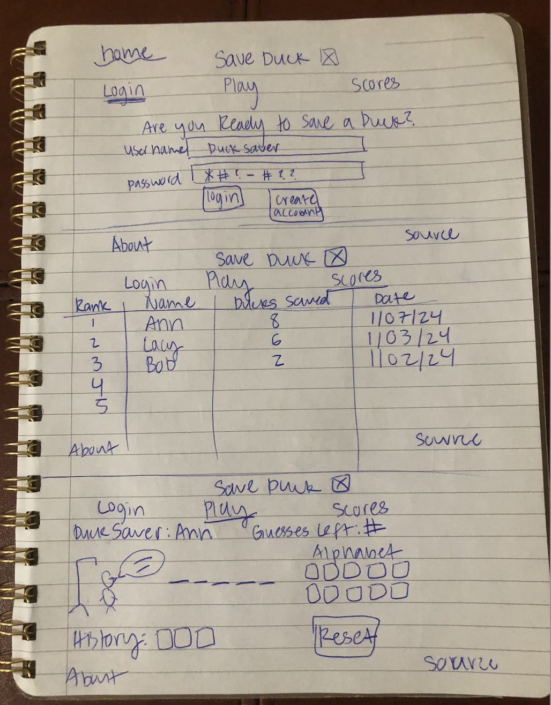

# SaveDuck 🦆
> The less gory game of Hangman: saving ducks by solving words! 

## Startup Specification Deliverable
### Elevator Pitch

Introducing SaveDuck, a twist on the classic word-guessing game! Ever felt that Hangman was a *tad* too dark? Delve into a world where every correct guess not only reveals the mystery word but also rescues an adorable duck. Join in this delightful journey where fun meets compassion. Experience all of the same fun and guess correctly to save the duck! 

### Design

### Key Features

- Secure login/registration over HTTPS (User account creation and login functionality + display of the player's name after logging in)
- Ability to play SaveDuck and view the scoreboard
- Includes both an About page and the source from GitHub
- Storage of words, user profiles, scores, and game details.
- Real-time updates on word progress and duck reactions.
### Technologies

How I will be using each of the required technologies:
- **HTML** - Uses correct HTML structure for application. Four HTML pages: Login, Play, Scoreboard, and the About Page. Displaying the virtual duck, word underscores, and interactive buttons.
- **CSS** -Styling the game for a visually appealing and responsive design. Each page uses good design choices such as whitespace, colors, typography, and contrast.
- **JavaScript** - Provides various displays for each page. Includes user interaction for guessing letters via clickable alphabet buttons and logic for revealing correct guesses and tracking incorrect ones. (ex: interactive gameplay, letter selection, and text updates.)
- **Service** - Backend service with endpoints for:
  - login
  - retrieving scores (including the date, names, etc.)
- **DB/Authentication** - Stores both the users and the date in the database. Authentication through registration and and login with credentials securely stored in the database. 
- **WebSocket** - After a user plays, they can check the scoreboard for their rank and their data is rendered each time a user starts/ends a game. Facilitating real-time communication between the client and server. Ensuring instant updates on word progress, duck reactions, and game events.
- **React** - Application ported to use the React web framework.

## HTML Deliverable
➡️  For this deliverable I built out the basic content/structure of my application using HTML
- **HTML Pages**  - 4 pages: index, play, scoreboard, and the about page -> neccessary for logging in and playing SaveDuck.
- **Links** - Each page is accessible on every page.
- **Application** - Simple alphabet buttons, word underscores, and user name.
- **DB/Login** - Scoreboard for most ducks saved. Form for user to create an account and/or login as well as displaying their name. 
- **Images** - Plenty of placeholder images of ducks (ex: about, play, and index have some)
- **WebSocket Data** - Speach bubble for duck to display messages to the user in real time. 

## CSS Deliverable

## JavaScript deliverable

## Service deliverable

## DB/Login deliverable

## WebSocket deliverable

## React deliverable

## Notes
[Notes](startup/notes.md)